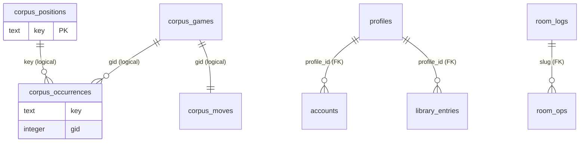

# ERD and Historical Evidence

This document describes the persistent data model (ERD) and, in detail,
how the historical-evidence feature works — including every query it
executes and why.

The app has **no single database**. Persistence is three separate schemas
with different owners (ADR-0026, ADR-0028, ADR-0029). All three currently
live on the same Fly Postgres cluster (`blunderfest-db`), but they are
logically independent boundaries, each behind its own boundary module.

```
                    Fly Postgres cluster (blunderfest-db)
   +---------------------------------------------------------------+
   |  Application data        Durable room log      Corpus         |
   |  (Ecto Repo, boot-       (Postgrex-direct,     (Postgrex-     |
   |   migrations,            RoomLog.Store,        direct, Corpus |
   |   ADR-0029)              ADR-0028)             boundary,      |
   |                                                 ADR-0026)     |
   |  profiles                room_logs             corpus_        |
   |  accounts                room_ops              positions      |
   |  library_entries                               corpus_        |
   |                                                occurrences    |
   |                                                corpus_games   |
   |                                                corpus_moves   |
   +---------------------------------------------------------------+
```

Not in any database (in-memory, ADR-0001): room GenServers (the op log is
the authoritative room state), the engine pool, Lichess OAuth flow state,
the demo room. The room op log's durable *mirror* (ADR-0028) is the only
room state that is persisted.

---

## 1. ERD

### 1.1 Application data — Ecto `Repo` (ADR-0029, self-migrates at boot)

```
profiles                                              accounts
+------------------------------------------------+    +----------------------------------------------+
| id              string   PK  (non-autogen)     |    | id            bigserial  PK                  |
| name            string   NOT NULL  UNIQUE      |<---| profile_id    string  FK -> profiles.id      |
| secret_hashes   string[] NOT NULL  default []  |    |               (ON DELETE CASCADE)  NOT NULL  |
| created_at      utc_datetime_usec  NOT NULL    |    | type          string    NOT NULL             |
+------------------------------------------------+    | username      string    NOT NULL             |
                                                      | access_token  string    NULL                 |
1 profile has 0..n accounts                           | scopes        string[]  NOT NULL default []  |
  (linked external identities / recovery keys,        | linked_at     utc_datetime_usec NOT NULL     |
   ADR-0022)                                          | UNIQUE (type, username)                      |
                                                      +----------------------------------------------+

profiles 1 --- 0..n library_entries

library_entries
+--------------------------------------------------+
| id          string   PK  (non-autogen)           |
| profile_id  string   FK -> profiles.id           |
|             (ON DELETE CASCADE)  NOT NULL        |
| tree        jsonb (Ecto :map)  NOT NULL          |   <- full saved game tree
| saved_at    utc_datetime_usec  NOT NULL          |
| INDEX (profile_id, saved_at)                     |
+--------------------------------------------------+
```

Semantics:

- `profiles.secret_hashes` holds one salted hash per device secret, so
  signing in on a new device adds a hash without invalidating the old ones.
- `accounts.{type,username}` is globally unique: an external account maps
  to exactly one profile.
- All three tables are created by the boot-time migration
  (`priv/repo/migrations/20260827010000_create_app_data_tables.exs`,
  advisory-locked so the two-node cluster's simultaneous boots are safe).

### 1.2 Durable room log — Postgrex-direct (ADR-0028, `RoomLog.Store`)

```
room_logs                                            room_ops
+---------------------------------------------+      +---------------------------------------------+
| slug            text  PK                    |<-----| slug         text  FK -> room_logs.slug     |
| roles           jsonb NOT NULL  default {}  |      |              (ON DELETE CASCADE)  NOT NULL  |
| last_active_at  timestamptz  NOT NULL       |      | seq          integer  NOT NULL              |
+---------------------------------------------+      | type         text     NOT NULL              |
                                                     | payload      jsonb    NOT NULL  (the op)    |
room_logs 1 --- 0..n room_ops                       | author       text     NOT NULL              |
                                                     | author_name  text     NULL                 |
  PK (slug, seq)                                    | ts           timestamptz  NOT NULL          |
  (sequential scan per slug off the PK,             +---------------------------------------------+
   no other indexes)
```

Semantics:

- A write-through mirror: every non-cursor op is appended as the room
  appends it; roles are persisted on change; a starting room loads its
  log, roles, and activity time back.
- Best-effort only — failures are logged, never raised; the in-memory log
  is authoritative.
- Purge paths: eviction deletes the rows with the room; the room
  sweeper's backstop removes rows idle past the 1h threshold with no live
  process cluster-wide.

### 1.3 Corpus — Postgrex-direct, UNLOGGED, rebuildable (ADR-0026)

```
corpus_positions                           corpus_occurrences
+---------------------------------------+  +--------------------------------------------+
| key       text    PK                  |<-| key   text    NOT NULL (logical FK -> key) |
| pawn_hash bigint  NOT NULL [index]    |  | gid   integer NOT NULL (logical FK -> gid) |
| first_gid integer NOT NULL            |  | ply   smallint NOT NULL                    |
| first_ply smallint NOT NULL           |  |                                            |
+---------------------------------------+  | INDEX (key)                                |
                                           +--------------------------------------------+

corpus_games                                corpus_moves
+---------------------------------------+  +--------------------------------------------+
| gid          integer PK               |  | gid   integer PK                          |
| white        text   NOT NULL          |  | sans  text    NOT NULL                    |
| black        text   NOT NULL          |  |       (space-joined mainline SAN list,    |
| result       text   NOT NULL          |  |        e.g. "e4 e5 Nf3 Nc6 Bb5 ...")      |
| date         text   NOT NULL          |  +--------------------------------------------+
| eco          text   NOT NULL          |
| opening      text   NOT NULL          |  corpus_games.gid 1 --- 1 corpus_moves.gid
| white_elo    integer NULL             |  (logical, no constraint)
| black_elo    integer NULL             |
| event        text   NOT NULL          |
| time_control text   NOT NULL          |
| site         text   NOT NULL          |
+---------------------------------------+
```

Relationships (all logical, see below):

- `corpus_occurrences.key` -> `corpus_positions.key` (many-to-one)
- `corpus_occurrences.gid` -> `corpus_games.gid` / `corpus_moves.gid`
  (many-to-one)
- `corpus_positions` keeps **one** row per distinct key (its true first
  `(gid, ply)`); `corpus_occurrences` keeps **every** occurrence.
- `corpus_positions.pawn_hash` is the 63-bit pawn-skeleton bucket hash
  (BLAKE2b-128 truncated to fit a signed `bigint`).

Key points:

- **No FK constraints anywhere in the corpus.** The tables are UNLOGGED,
  COPY-loaded, and dropped/rebuilt wholesale, so the relationships are
  purely logical (name-based joins on `key` and `gid`).
- The `keys-N.tsv` / `positions-N.tsv` / `games-N.tsv` / `moves-N.tsv`
  extraction artifacts are the "source tables" of the derivation pipeline
  (section 2.1); a transient `corpus_positions_stage` table exists only
  during a rebuild.

A Mermaid diagram is available below for the corpus layer:


---

## 2. How historical evidence works, in detail

### 2.1 What "a position" means (the foundation)

Before any query, every board state is reduced to a **canonical key**
(`Blunderfest.Corpus.PositionKey`, X-FEN/Shredder-FEN convention):

```
<piece placement> <side to move> <castling rights> <en passant>
```

The FEN move counters are dropped (they describe history, not the
position). The en-passant field is included **only when a legal EP
capture exists**, so `1.e4` and `1.e3 d6 2.e4` produce the *same* key
even though their raw FENs differ. This is what makes "same position"
retrieval work across transpositions.

- `PositionKey.to_hash128/1` — BLAKE2b truncated to 16 bytes; the stable
  128-bit position identity (deliberately not echecs' compile-time-seeded
  Zobrist).
- `Features.pawn_hash/1` — BLAKE2b-128 of the pawn skeleton, truncated to
  **63 bits** so it fits a signed `bigint`; used only as a bucket, so a
  rare collision merely merges two buckets and cannot produce a wrong
  candidate.

The corpus is pre-built offline from a Lichess database PGN (ADR-0026's
"PGN -> moves -> positions -> indexes" invariant):

1. `mix corpus.extract` — streams the PGN, replays every game's mainline
   with `Echecs`, and writes four TSV artifacts:
   - `keys-N.tsv` (`canonical_key \t gid \t ply`, one row per ply)
   - `occ-N.tsv` (`position_hash128_hex \t gid \t ply`) — written for
     run statistics, never loaded into the store
   - `games-N.tsv` (game headers, 12 columns)
   - `moves-N.tsv` (`gid \t SAN SAN SAN ...`, raw mainline, unnumbered)
2. `mix corpus.prepare` — precomputes `positions-N.tsv`
   (`key \t pawn_hash \t gid \t ply`) so the load machine does pure COPY
   (survives the shared-vCPU throttling that stalls the hashing stream
   mid-COPY).
3. `mix corpus.load` — drops the four UNLOGGED tables, COPY-loads them,
   dedupes positions to first occurrences (`SELECT DISTINCT ON (key) ...
   ORDER BY key, first_gid, first_ply`), builds the two indexes
   (`corpus_positions(pawn_hash)`, `corpus_occurrences(key)`), runs
   `ANALYZE`, and reports row counts.

The checked-in tier is 100k games (data/corpus/: positions 551 MB,
occurrences 281 MB, games 13 MB, moves 29 MB). Everything after the
canonical PGN is derived and rebuildable — that is why the tables are
UNLOGGED and carry no constraints.

### 2.2 The runtime request — one FEN in, structured evidence out

The UI calls `POST /api/historical-evidence` with
`{fen, route, ref_ply}` (`route` = the SAN list leading to the position
in the user's game; `ref_ply` = the ply of the position within it; both
optional). The call chain:

```
HistoricalEvidenceController
  -> Blunderfest.HistoricalEvidence.analyze/2    (the stable service API)
    -> PositionKey.from_fen/1                    (FEN -> canonical key, local)
    -> Blunderfest.Corpus.Search.Pipeline.analyze/2
    -> to_dto/1                                  (facts-only serializable DTO)
```

Everything below runs **behind the `Blunderfest.Corpus` GenServer
facade**, which owns the Postgrex pool and serializes every query through
one process — the physical representation (Postgres today, the packed
binary index later) stays replaceable behind this surface, and
application code never sees a table, a key encoding, or a connection.
When no `db:` config exists, the process starts inert and every query
returns `{:error, :not_configured}` instead of crashing.

The pipeline's contract (ADR-0027): **no relevance score, ever**. Every
stage exposes independently-observable facts — typed differences, routes,
family memberships, counts — and the client owns all interpretation and
presentation.

```
pipeline stages:

candidate generation -> position comparison -> route / difference analysis
-> continuation analysis -> continuation / plan families -> historical
counts -> per-candidate evidence
```

#### Stage 1 — Candidate generation (`Corpus.Search.Candidates`)

| # | Query | Why |
|---|-------|-----|
| Q1 | `SELECT gid, ply FROM corpus_occurrences WHERE key = $1 ORDER BY gid, ply` | **All exact occurrences** of the reference key. One fetch serves three consumers: the *exact candidates* (capped at `:exact_limit` 12 for display), the *decision menu* (which needs every occurrence, not the cap), and the *reference counts*. |
| Q2 | `SELECT key FROM corpus_positions WHERE pawn_hash = $1 ORDER BY key` | The **pawn-skeleton bucket**: every distinct canonical key sharing the reference's pawn structure. This is the only structural (non-exact) retrieval strategy — uncontrolled relaxed retrieval produced ~1M candidates in research and is deliberately not implemented. |

For Q2's result (capped at `:bucket_limit` 2000 keys): each bucket key is
parsed into feature bitboards **locally** (`Features.from_key`) and
ranked by piece-overlap match count — no query yet. Only the top
`:scan_limit` 30 keys get occurrence fetches, which is what dropped the
KID tabiya's bucket scan from ~2.2s to ~0.3s:

| # | Query | Why |
|---|-------|-----|
| Q3 | same query as Q1, one per top-ranked bucket key | Fetch each structurally-similar key's occurrences (up to 8 per key) -> draft `:pawn_skeleton` candidates. |

Draft structural candidates are deduplicated by `{key, gid}` (first
occurrence wins — their purpose is distinct *positions*, not occurrence
counts), then sorted by piece-placement matches and capped at `:limit`
10. Exact candidates keep **every** occurrence — repeated positions
inside one game are exposed by the evidence layer as a `same_game_only`
flag, not silently dropped.

Output: `%{exact: [candidate], exact_occurrences: [...], structural:
[candidate], reference: features}`. Each candidate carries its
`:strategy`, computed `:dims`, and a `:why` line — the two retrieval
strategies stay independently observable, never merged into a score.

#### Stage 2 — Decision menu and reference facts (`Pipeline.do_analyze`)

For **every exact occurrence** (uncapped), the pipeline fetches the
game's mainline to build continuation windows:

| # | Query | Why |
|---|-------|-----|
| Q4 | `SELECT sans FROM corpus_moves WHERE gid = $1` | One per occurrence gid. `sans` is sliced from the occurrence's ply (window capped at 12 moves) and fed to two consumers: **`Families.build`** (the decision menu) and **`DecisionMenu.from_occurrences`** (the raw next-move distribution). |

The **reference continuation window** is *not* a query — it is sliced
from the client-supplied `route` / `reference_moves` at `ref_ply`. The
reference's `occurrences` / `games` counts are computed locally from the
already-fetched Q1 list.

- **Families — the decision menu.** The distinct continuations actually
  played after the reference position, clustered by single-linkage
  union-find at the slice-wide setting (window 6, multiset Jaccard,
  threshold 0.5 — Spike 04's validated F1 setting; per-reference tuning
  is deliberately out of scope). Output: families sorted by occurrence
  count, each with `id`, `occurrences`, `games`, and `members`
  (`%{seq, count}`).
- **DecisionMenu — the raw next-move distribution.** Counts, per distinct
  first move, the number of *independent games* that played it (a
  `MapSet` of gids per move). Computed alongside families from the same
  triples because Spike 07 measured that family clustering chains
  genuinely different directions together under the general settings
  (A2: 68/71 games in one family; Najdorf: 445/477) — the raw
  distribution has no such failure and is the reliable overview.

#### Stage 3 — Per-candidate evidence (`Pipeline.card`)

For each of the exact (~12) plus structural (<=10) candidates:

| # | Query | Why |
|---|-------|-----|
| Q5 | `SELECT sans FROM corpus_moves WHERE gid = $1` | The candidate's own mainline -> its continuation window (for the typed continuation differences and the family/skeleton membership checks) and its full move list (for the route comparison). |
| Q6 | `SELECT gid, ply FROM corpus_occurrences WHERE key = $1 ORDER BY gid, ply` | The candidate **key's** own occurrences -> its historical counts (`occurrences`, `games`, `same_game_only`). This powers the central honesty distinction: occurrences and independent games must never be conflated — "27 occurrences / 19 independent games" is recurring evidence, "27 occurrences / 1 game" is a repetition, not evidence. |
| Q7 | `SELECT white, black, result, date, eco, opening, white_elo, black_elo, event, time_control, site FROM corpus_games WHERE gid = $1` | Candidate game metadata for the evidence card (players, result, ECO, opening, Elo, event, time control, site). |

All comparison math then happens **locally** on the feature bitboards
(`Features`, `Differences`, `Route`, `Families.membership`,
`Skeleton.membership`, `Counts`):

- **Positional typed differences** (`Differences.positional`): tempo
  twin / near twin / piece setup / king position / material / structure.
  The useful candidates differ from their reference by *exactly one typed
  difference* — and the difference, not the similarity, is what makes the
  candidate interesting. Each entry is `%{type, detail}` with a
  human-readable line.
- **Continuation typed differences** (`Differences.continuation`):
  same plan / timing shift / plan divergence, from the reference and
  candidate windows.
- **Route** (`Route.compare`): how the two games *reached* the
  (near-)shared position — shared plies, the first diverging ply and the
  move each side played there, per-side extra/missing moves, and
  `ply_gap` = candidate ply - reference ply. Mechanical, not
  interpretative: it exposes the tempo/deviation material (e.g. "the
  candidate played e3 where the reference played e4, reaching the
  equivalent position one ply later") for the user to read.
- **Family membership** (`Families.membership`): the candidate joins a
  family when its window similarity reaches the threshold
  (single-linkage); otherwise the nearest family is reported with its
  similarity, so "no family" stays visible instead of being forced.
- **Per-side plan-skeleton membership** (`Skeleton.membership`): a
  separate annotation layer on top of the baseline families (Spike 06 —
  skeleton clustering is *not* allowed to replace family clustering).
  Each color joins a family when its per-color action-set similarity
  reaches 0.5; a tempo twin reads as "black executes the plan (joined),
  white reacts (did not)".
- **Flags**: `same_game_only` (every occurrence from one game — the same
  game a few plies later, not an independent example), `singleton` /
  `singleton_family` (one-game continuations must not be presented as
  recurring historical evidence — the concrete Spike 05 failure), plus
  the typed difference types. Material for the UI, never a ranking.

#### Stage 4 — The response

Facts only (ADR-0027), serialized by `HistoricalEvidence.to_dto/1`:

```
{
  reference: { fen, occurrences, games, families, next_moves },
  candidates: [ {
    id, strategy, stm, fen, gid, ply, game,
    position: { dims, differences },
    route: { shared_plies, ref_ply, diverged_ply, ref_move, cand_move,
             ply_gap, extra_white, extra_black, missing_white, missing_black },
    continuation: { moves, differences },
    families: { membership, skeleton: { white, black } },
    historical: { occurrences, games, same_game_only },
    flags: [...]
  } ],
  timings: { candidates_ms, menu_ms, evidence_ms, total_ms }
}
```

### 2.3 The opening book — same store, sibling queries

The same corpus tables power the opening book (ADR-0024), a useful
contrast since it is also "historical evidence":

| # | Query | Why |
|---|-------|-----|
| Q8 (`Book.for_key`) | `SELECT DISTINCT o.gid, o.ply, m.sans, g.result FROM corpus_occurrences o JOIN corpus_moves m ON m.gid = o.gid JOIN corpus_games g ON g.gid = o.gid WHERE o.key = $1` | Every occurrence joined to its move list and game result in **one** query -> the next-move W/D/B stats per move, collapsed to independent games (a `MapSet` per move: a game that reaches the position twice and plays the same move both times counts once). |
| Q9 (`Book.counts_for_keys`) | `SELECT key, COUNT(DISTINCT gid) FROM corpus_occurrences WHERE key = ANY($1) GROUP BY key` | Independent-game counts for a **batch** of canonical keys in one query — the support for the one-ply-back-to-book transposition candidates in the PositionContext panel. |

There is also `GET /api/historical-evidence/games/:gid` (the "open the
full game" feature): Q7 + Q5 per gid, then the headers + numbered mainline
are re-assembled into a PGN and parsed into a playable tree
(`Corpus.GameExport`) — the corpus drops clocks, comments and variations
by design, so the export is a clean mainline.

### 2.4 The full query flow at a glance

```
POST /api/historical-evidence { fen, route, ref_ply }

  Q1  corpus_occurrences WHERE key = <refKey>        -> exact candidates (cap 12),
                                                        decision menu, reference counts
  Q2  corpus_positions WHERE pawn_hash = <bucket>    -> bucket keys (cap 2000),
                                                        rank locally, take top 30
       Q3 corpus_occurrences WHERE key = <bucketKey> (x30) -> structural candidates (cap 10)

  Q4  corpus_moves WHERE gid = <occ gid> (x all exact occurrences)
                                                     -> Families.build + DecisionMenu
  -- locals -- reference window from route/ref_ply, counts from Q1

  per candidate (exact + structural, ~22):
    Q5 corpus_moves       WHERE gid = <cand gid>     -> candidate window + route
    Q6 corpus_occurrences WHERE key = <cand key>     -> candidate counts, same_game_only
    Q7 corpus_games       WHERE gid = <cand gid>     -> card metadata

  -> facts-only JSON + stage timings
```

Measured on the 100k tier: 170-354 ms per request (start position / KID
tabiya / Ruy Lopez tabiya), dominated by the per-candidate sequential
Q5-Q7 through the single facade GenServer. The packed binary index
(ADR-0026's successor store) replaces this path if the corpus grows.

### 2.5 Why it is designed this way

- **Everything except the PGN is rebuildable** (ADR-0026) -> UNLOGGED
  tables, no constraints, wholesale drops are safe, and the store can be
  swapped behind the boundary.
- **Canonical keys, not FENs** -> transpositions match; the EP and
  counter conventions cannot split or merge positions wrongly; a 128-bit
  identity with a 63-bit bucket hash.
- **Occurrences are never conflated with independent games** -> the
  decision menu, the book, and the flags all count distinct gids, and
  `same_game_only` / `singleton` / `singleton_family` explicitly mark
  non-evidence so it cannot be presented as history.
- **Evidence, not scores** -> two retrieval strategies that stay
  independently observable, explicit caps that are visible rather than
  hidden in a ranking, typed differences and route facts instead of a
  fused relevance number. The client owns the presentation; the API owns
  nothing but the facts.
